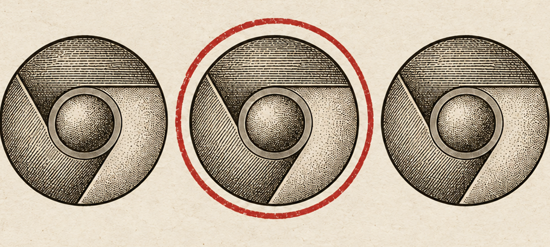
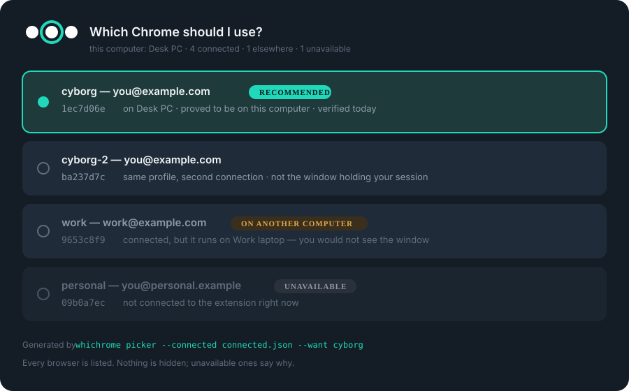

<p align="center">
  
</p>

<h1 align="center">Whichrome</h1>

<p align="center">
  <b>Know which Chrome you're driving.</b><br>
  <sub>A registry and a Claude skill that stop your AI agent opening pages in the wrong browser, on the wrong computer.</sub>
</p>

<p align="center">
  
  
  
  
</p>

---

## The problem

Claude's Chrome extension lists your connected browsers like this:

```
Browser 1    Browser 2    Browser 3    Browser 4
```

That's it. The names are positional, they shuffle between sessions, renaming them in Chrome
doesn't stick, and **nothing tells you which computer each one is on**.

So your agent guesses. It opens a page on your work laptop while you're sitting at your
desktop, and you spend five minutes hunting for a window that isn't on your screen.

It gets worse: one Chrome profile can connect **twice**, showing up as two entries with the
same account, where only one holds the window with your live session. They are
indistinguishable. Picking the wrong one looks exactly like success.

## The fix

Whichrome remembers. Ask for a browser by name and it resolves to the right one:

```console
$ whichrome resolve cyborg
1ec7d06e-6042-43e8-b2c4-611bd9ec5afe  cyborg - you@example.com - THIS computer
```

And when the agent has to ask, the question is actually answerable:

<p align="center">
  
</p>

<p align="center"><sub><i>A field guide exists to tell near-identical specimens apart. So does this.</i></sub></p>

## Install

**As a Claude Code plugin** (recommended, works on every machine you run it on)

```
/plugin marketplace add chilooby/whichrome
/plugin install whichrome@whichrome-marketplace
```

The skill and the `whichrome` command arrive together, and updates come through the
marketplace. Then register the computer you are on once:

```bash
whichrome device --label "Desk PC" --scan
```

### Or install the standalone script

**macOS · Linux · Git Bash**

```bash
curl -fsSL https://raw.githubusercontent.com/chilooby/whichrome/main/install.sh | bash
```

**Windows PowerShell**

```powershell
irm https://raw.githubusercontent.com/chilooby/whichrome/main/install.ps1 | iex
```

Run it once per computer. It installs the skill into `~/.claude/skills/whichrome/`, drops a
`whichrome` launcher in `~/.local/bin`, registers the machine you're on, and reads Chrome's own
`Local State` so every local profile is already mapped to its signed-in account.

Then just use Claude normally. The skill fires before any browser action.

### Where it works

| Surface | Works? | Why |
| --- | --- | --- |
| **Claude Code (CLI)** | Yes | Reads `~/.claude/skills/`, runs the CLI over Bash, drives the Chrome extension |
| **Claude Code (desktop / IDE)** | Yes | Same machine, same skills folder, same registry |
| **Claude Code on the web** | No | Runs in a cloud sandbox with no access to your local Chrome or registry |
| **claude.ai chat** | No | No local shell and no `~/.claude/skills`, so neither the skill nor the CLI can load |

Install it on each computer you actually sit at. The registry is per-user and syncs
by pointing `WHICHROME_REGISTRY` at a shared location.

<sub>Prefer not to touch your environment? Pass <code>-NoEnv</code> (PowerShell) or set <code>WHICHROME_NO_ENV=1</code> (bash).
No <code>whichrome</code> on PATH? Every command below works as <code>python &lt;repo&gt;/bin/whichrome.py …</code> too.</sub>

## What it does

### Remembers profiles by deviceId

The only stable handle the extension exposes. Nicknames, accounts, aliases and Chrome profile
directories hang off it. The same browser was `Browser 3` one day and `Browser 2` the next; the
deviceId never moved.

### Knows which computer each browser is on

Every record is keyed to a device fingerprint (hostname + machine UUID). A browser registered
on your desktop reads `REMOTE - not this computer` when you're on your laptop.

### Proves locality instead of trusting a flag

The extension's `isLocal` has reported `true` for browsers on other machines. Whichrome serves a
nonce on loopback and points the browser at it. Only a Chrome on this machine can reach it:

```bash
whichrome beacon start --port 8799 --nonce probe-1 &
# ...navigate the browser to http://127.0.0.1:8799/probe-1...
whichrome beacon check --nonce probe-1 --port 8799   # exit 0 local · 3 not local · 4 port busy
```

Only a request carrying the nonce counts, each probe gets its own state file, and the port
isn't shareable, so a stray page can't forge a local verdict.

### Never claims proof it doesn't have

Locality is a tri-state, not a boolean. `THIS computer` means beacon-proved. Anything softer
says so out loud: `recorded here, not beacon-proved`.

### Syncs across devices

The registry is one plain JSON file at `~/.whichrome-registry.json`. Point
`WHICHROME_REGISTRY` at a synced folder or a private repo and every Claude session on every
machine sees the same browsers.

## CLI

| Command | What it does |
| --- | --- |
| `whichrome device --label "Desk PC" --scan` | Register this computer, map its Chrome profiles |
| `whichrome picker --connected c.json --want cyborg` | Ready-made picker options, unavailable ones marked |
| `whichrome roster --connected c.json --json` | Merge the extension's list with the registry |
| `whichrome resolve cyborg --quiet` | Nickname → deviceId |
| `whichrome record --id <id> --nickname cyborg --account you@example.com --default --local` | Save what you learned |
| `whichrome nicknames` | Everything known |
| `whichrome beacon start` / `check` | Locality proof |
| `whichrome forget <id>` | Drop a record |

`roster` and `picker` take the `list_connected_browsers` JSON array from a file or stdin, and
tolerate prose pasted around it. `roster --json` reports `knownLocalHere` as `true`
(proved here), `"probably-here"`, `"probably-remote"`, `false` (proved elsewhere) or `null`.

## Registry format

```jsonc
{
  "version": 1,
  "devices": {
    "DESKPC|00000000-…": {
      "label": "Desk PC",
      "hostname": "DESKPC",
      "os": "Windows",
      "lastSeen": "2026-09-11",
      "chromeProfiles": { "Profile 1": "you@example.com" }
    }
  },
  "browsers": {
    "1ec7d06e-…": {
      "nickname": "cyborg",
      "account": "you@example.com",
      "chromeProfileDir": "Profile 1",
      "device": "DESKPC|00000000-…",
      "localityProof": "beacon",
      "aliases": ["research"],
      "default": true,
      "lastVerified": "2026-09-11",
      "notes": "The window holding the signed-in session."
    }
  }
}
```

It holds account addresses, machine labels and a machine id — never tokens or cookies. That's
still personal data, which is why it lives in your home directory and is gitignored. A clone you
publish contains `registry.example.json` and nothing about you. `--scan` reads only the profile
directory name and signed-in address from Chrome's `Local State`, and ignores the rest.

## Gotchas worth knowing

- **`accounts.google.com` is blocked for the extension.** Google sign-in and OAuth consent
  screens must be clicked by a human. Whichrome's job is making sure that human is told *which
  window, on which computer*.
- **The extension often opens its tab group in a separate Chrome window** sitting behind the
  others.
- **One profile can connect twice** with the same account, and only one holds your live session.
  Nickname them apart and mark the live one `--default`; the account fingerprint can't tell them
  apart.
- **Tab ids belong to one browser.** After switching, re-read the tab context.

## Requirements

Python 3.9+, git, and Claude with the Chrome extension. No third-party packages.

## License

MIT
